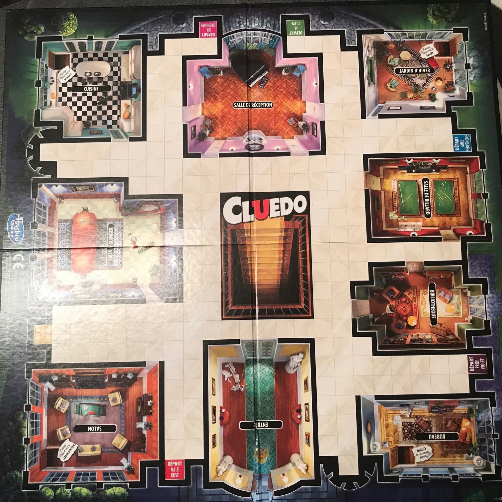
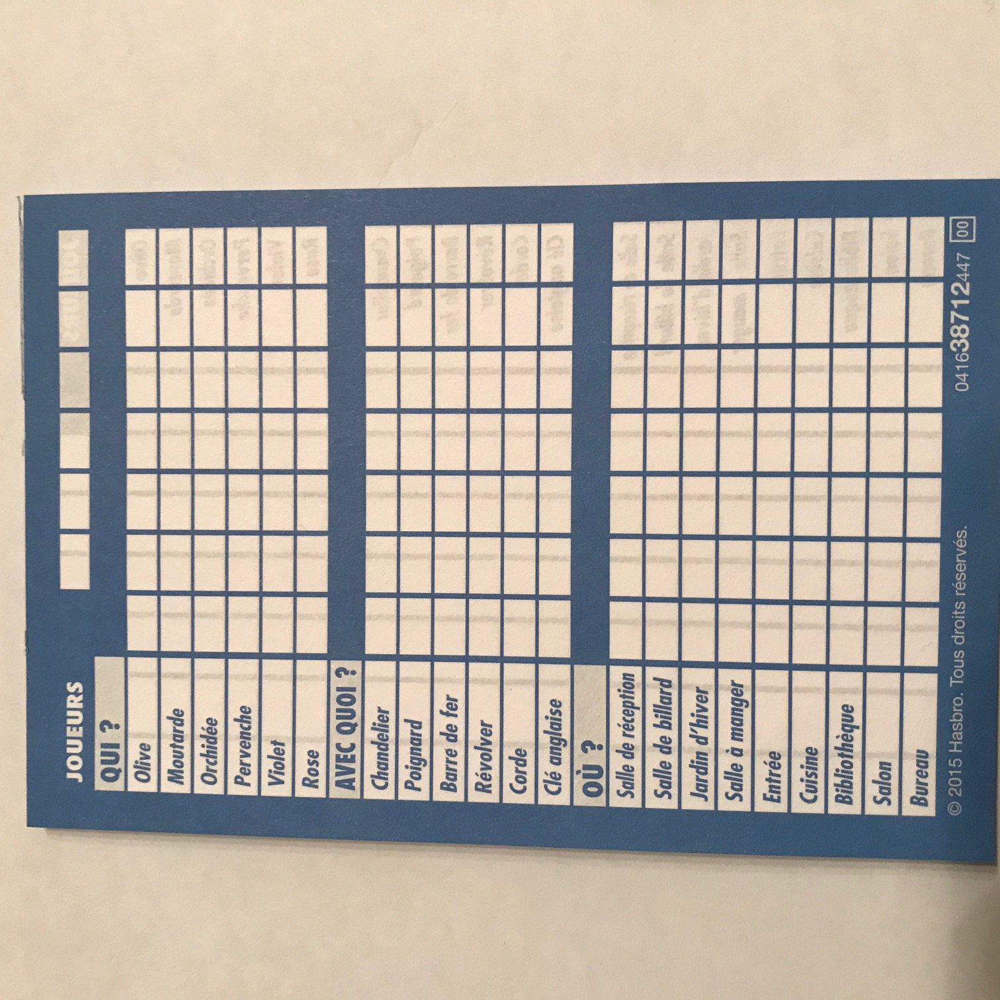

= projet M1 MIAGE - semestre 2
Frédéric Moal, Yohan Boichut
version 2019-2020

== Contexte
Depuis quelques années, nous reprenons des jeux de sociétés (plus ou moins connus) et nous développons des versions on-line : Stratego, le jeu des fantômes, le fantôme de Mc Gregor etc. Cette année, nous nous attaquons à un grand classique : Cluedo. Le principe du jeu est de découvrir qui a tué le docteur Lenoir. 
Les règles du jeu seront celles de la nouvelle édition *Hasbro* (elles sont décrites dans la suite). L'application devra être une application client/serveur. Côté serveur, nous aurons un Springboot avec 
un service Rest et côté client, un programme JavaFx. 

== Fonctionnalités

Nous devrons pouvoir

* S'inscrire à la plate-forme (nom, mot de passe)
* Se désinscrire
* Se connecter
* Se déconnecter
* Créer une invitation de jeu de 2 à 5 joueurs (pour des parties de 3 à 6 joueurs)
* Rejoindre une partie sous invitation
* Sauvegarder une partie en cours avec l'accord des autres participants. Le maître du jeu (celui qui a créé la partie) peut 
demander d'interrompre la partie. Si les autres acceptent, la partie est enregistrée dans son état et les individus sont redirigés en dehors de la partie (mais reviennent sur leur menu principal). 
* Restaurer une partie : Le maître du jeu peut restaurer une partie sauvegarder. Des invitations sont automatiquements présentes sur les accueils des autres joueurs. Une fois que les joueurs sont tous là, la partie reprend où elle en était. De ce fait, la partie ne sera plus enregistrée sauf si les joueurs demandent de nouveau d'interrompre la partie. 
* jouer au Cluedo (avec les actions normales du Cluedo) : révéler des cartes quand on vous le demande, émettre des suppositions, accuser, lancer les dés, déplacer son pion, 
prendre des passages secrets, tirer des cartes indices, consulter son carnet d'enquêteur, consulter ses cartes en main, etc.

=== Lot 1 -- Client Java FX

Le client JavaFX doit permettre d'effectuer toutes les opérations prévues précédemment. De plus, votre application doit obligatoirement respecter le MVC. 
Vous devrez fournir un lot de tests fonctionnels validant votre lot. 

=== Lot 2 -- Le(s) web service(s) et la persistance en Mongo

Evidemment, le web-service devra proposer tout ce qui est attendu pour que l'application client/serveur réponde aux besoins. La base Mongo sera là pour stocker les utilisateurs mais également les parties sauvegardées. 

== Description du contenu du jeu

* 6 personnages : Professeur Violet, Docteur Orchidée, Colonnel Moutarde, Mademoiselle Rose, Madame Pervenche, Monsieur Olive
* 6 armes : la corde, le poignard, la clé anglaise, le chandelier, le révolver, la barre de fer
* 9 lieux : la bibliothèque, la salle à manger, le jardin d'hiver, la salle de billard, le salon, le bureau, la cuisine, l'entrée et la salle de réception

Les 6 personnages sont jouables, les 9 lieux visitables. Les 21 items sont également représentés par autant de cartes. 

Dans la version récente du jeu, il y a également 29 cartes indices réparties comme suit :

* 9 cartes *où* : Ces cartes obligent les joueurs de révéler un lieu. Il y a une carte par lieu. Par exemple, on peut trouver sur ces cartes la phrase : "La personne qui a la carte de la Salle de réception doit la révéler et la laisser face visible devant elle".
* 6 cartes *Que s'est il passé* : c'est exactement le même principe que les cartes *où* mais avec un personnage. Il y a une carte de ce genre par personnage. 
* 6 cartes *Qu'est ce que c'était* : Vous l'avez deviné, c'est encore le même principe mais cette fois ci, avec les armes. Il y a une carte de ce genre par arme. 
* 8 cartes spéciales : 
** Une qui oblige tous les joueurs à révéler une carte de leur main
** Une qui demande à un joueur de nommer une arme. Si quelqu'un possède la carte de l'arme nommée, il doit alors la révéler
** Une carte identique à la précédente mais avec un lieu
** Une carte identique à la révélation d'une arme mais pour un personnage au choix
** Une carte "Tous les joueurs montrent une carte discrètement au joueur de gauche"
** Une carte "Choisissez le joueur qui a l'air le plus coupable. Il met une carte de sa main face visible devant lui."
** Une carte "Vous trouvez un passage secret. Mettez cette carte dans la pièce de votre choix. Elle est maintenant reliée aux autres passages secrets."
** Une carte "Tous les joueurs se précipitent dans la pièce de votre choix"

Vous ajoutez à ceci deux dés à 6 faces dont le 1 est remplacé par une loupe.

== Jouer

=== Préparation du jeu

Initialement, une carte personnage, une carte lieu et une carte arme sont retirées aléatoirement.
Elles définissent le coupable, le lieu et l'arme.
Les autres cartes "lieu", "arme" et "personnage" sont distribuées aux joueurs.
Certains peuvent donc finalement avoir plus de cartes que d'autres en main (selon le nombre de joueurs).
Chaque personnage joué se place sur sa case personnelle de départ.

.Le plateau
[#img-plateau]

Une feuille de détective est distribuée à chaque joueur.

.La fiche de détective
[#img-fiche]

=== Déroulement du jeu

. Passez de pièces en pièces en émettant des hypothèses sur le meutre (qui et avec quoi dans la pièce où vous vous situez).
. Les autres joueurs vous montrent une carte s'ils en ont à vous montrer.
. Une fois que vous pensez avoir résolu le meurtre, portez votre accusation

=== Comment jouer ?

Mlle Rose commence toujours, et le jeu continue dans le sens des aiguilles d'une montre. Si personne ne joue le rôle de Mlle Rose, le jeu commence 
avec le personnage suivant sur le plateau dans le sens des aiguilles d'une montre i.e. Colonnel Moutarde, Orchidée, etc. 

A votre tour

. Lancez les dés. Avant de déplacer votre pion, résolvez les loupes si vous en avez obtenues. Une loupe = Une carte indice. Selon les instructions de la carte indice, appliquez la. 
Remettre la carte indice sous le tas de cartes indices une fois la carte appliquée. 
. Vous avez le choix entre trois actions : Déplacer votre pion, prendre un passage secret (si vous êtes dans une salle offrant cette possibilité) ou rester dans la pièce où vous êtes
(si vous êtes dans une pièce). Si vous choisissez de vous deplacer.
Déplacez votre pion de personnage du nombre de cases indiqués sur les dés. Dans ce cas là, une loupe = 1. Il est interdit de se déplacer en diagonale. Vous ne pouvez
pas passer par dessus un personnage (vous êtes donc obligés de le contourner). Vous ne pouvez pas passer deux fois par la même case pendant un même tour.
Si vous utilisez un passage secret, dirigez vous vers la salle reliée à ce passage. Sinon, restez dans votre pièce.
. Emettez une hypothèse : Vous avez le droit d'émettre une hypothèse que si vous êtes dans un lieu. Et cette hypothèse ne concerne donc que le lieu que vous occupez.
Une hypothèse porte sur un suspect, une arme et le lieu où vous êtes.

.. Déplacez le suspect dans le lieu concerné (qu'il s'agisse d'un PNJ (personnage non joueur) ou non).
.. Le joueur situé à votre gauche vous montre secrètement une carte incluse dans votre hypothèse s'il en a une. S'il en a plus d'une, il vous dévoilera celle de son choix parmi les cartes concernées. S'il n'a pas de cartes concernées, il l'annonce et c'est au joueur suivant
de vous montrer une carte et ainsi de suite jusqu'à ce qu'un joueur vous dévoile secrètement une carte.
.. Si personne n'a de carte, ce n'est pas un problème. Soit vous avez volontairement demandé des cartes que vous possédez dans le but de découvrir par élimination une
carte écartée.
.. Les personnages concernés par l'hypothèse ne rejoigne pas leur emplacement d'origine (PNJ ou non). Un PNJ restera dans la pièce jusqu'à ce qu'une nouvelle hypothèse le concernant soit mentionnée.
. Cochez votre feuille de détective en fonction des cartes connues à ce tour.

== Gagner

Une fois que vous pensez tout savoir du meutre, vous pouvez porter une accusation à votre fin de tour.

. Si malheureusement vous vous trompez alors vous êtes éliminés de la partie mais vous participez toujours pour la résolution des hypothèses.
. Si par contre vous avez raison alors vous avez gagné et la partie se termine.
. Si personne ne parvient à résoudre l'énigme... le coupable échappera donc à la justice.

  

== Livraisons

Trois livraisons _intermédiaires_ sont demandées

* Le 23 février 2020 :
  Tableau des URI prévues pour le(s) web-service(s) et maquette des écrans prévus pour le client
* Le 22 Mars 2020 :
  Une livraison fonctionnelle avec un CR des fonctionnalités opérationnelles. On peut partir sur la base : Enregistrement d'un utilisateur, désabonnement, connexion, déconnexion, invitations à une partie, rejoindre une partie, sauvegarder une partie et enfin recharger une partie.
* Le 12 avril 2020 :
  Une livraison fonctionnelle beta jouable.

La livraison finale sera le jour de la soutenance le 15 mai 2020.
Les trois livraisons intermédiaires seront déterminantes.
La dernière livraison ne concernera que les tests fonctionnels et d'intégration
ainsi qu'une documentation globale de l'application réalisés par les étudiants de formation initiale.
On attend également les petits ajustements vis à vis de la version beta livrée 1 mois plus tôt.

Vous êtes maîtres de votre organisation mais le contenu des livraisons représente ce que le client attend pour constater l'avancement du projet. Cela nécessite une bonne organisation au sein du projet pour que les fonctionnalités soient opérationnelles du client jusqu'au(x) web-service(s) inclus.
Vous avez le droit de prendre de l'avance évidemment :p

* NOTE: projet = 15 points / lot + 1/3 du lot complémentaire
      soutenance [démo] = 10 points

== Contraintes structurelles

Vous disposez d'un repo Git que vous *DEVREZ* utiliser pour l'ensemble de votre projet :

. code source
. fichiers de configuration
. jeux de données de test/démo pour la validation des lots
. documentation complète (architecture, code, README... )

Votre projet devra être organisé sous la forme d'un projet principal (pom parent)
et de modules pour chaque partie (e.g. web service, client JFX, ...),
Le projet *parent* devra être identifiable par maven (groupid:artifactId) de la façon suivante :
fr.miage.orleans.projetm1s2:groupe?
où ? est la lettre de votre groupe

Le déploiement du service et de la base Mongo devra se faire par un docker-compose

== Technos

Vous devrez utiliser les technos suivantes :

* MongoDB (obligatoire)
* JFx (obligatoire)
* Springboot (obligatoire)

== FAQ

Une FAQ est disponible à l'adresse suivante : https://pdicost.univ-orleans.fr/wiki/pages/viewpage.action?pageId=113737731

Vous pourrez poser vos questions sur cet espace et nous ferons de même pour y répondre.

